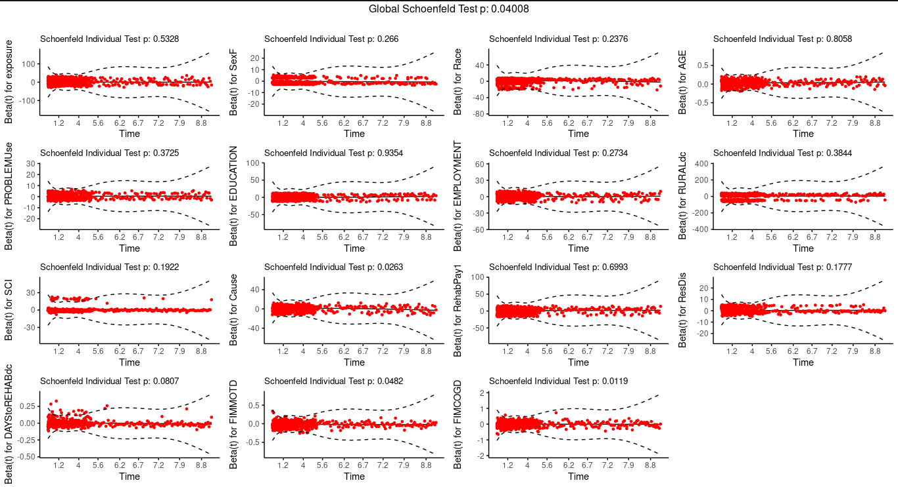

---

\newpage

**Effect of socioeconomic status of neighborhoods in mortality mortality rates after brain injury: retrospective cohort**

**Document version**

|Version |Alterations     |
|:-------|:---------------|
|01      |Initial version |

---

# Abbreviations

- FIM: Functional Independence Measure
- HR: hazards ratio
- SD: standard deviation
- SES: socioeconomic status

# Context

## Objectives

To determine the effect of socioeconomic status of the neighborhood on mortality of patients with brain injury.

<!-- ## Data reception and cleaning -->

# Methods

The data procedures, design and analysis methods used in this report are fully described in the annex document **SAP-2023-004-BH-v01**.

<!-- ## Study parameters -->

<!-- ### Study design -->

<!-- ### Inclusion and exclusion criteria -->

<!-- ### Exposures -->

<!-- ### Outcomes -->

<!-- ### Covariates -->

<!-- ## Statistical analyses -->

This analysis was performed using statistical software `R` version 4.2.1.

# Results

## Study population and follow up

There initially were 76665 observations on 19303 study participants considered for inclusion.
After applying the inclusion criteria for the study period between 2010-01-01 and 2018-12-31 and considering the status at the last available follow up time for each individual a total of 7972 participants were included in the analysis.
After excluding participants that were followed up concomitant with the COVID-19 pandemic to mitigate confounding on mortality causes there were 2692 participants left in the study sample.

The epidemiological profile of the participant included in the study was a
male participant (1,959 (73%))
with an average (SD) age of 36 (22) years.
The average (SD) time of follow up was 4.00 (2.18) years.

Races were not homogeneously available in the study population with
1,897 (71%) individuals being white;
978 (36%) were single (never married) at the time of injury,
and most participants were well educated with 1,239 (46%) at greater than high school level.
A total of 1,392 (52%) were employed and
1,292 (48%) participants lived in an urban area.

Table: **Table 1** Epidemiological, demographic and clinical characteristics of study participants.

|                                        **Characteristic**                                        | **N = 2,692** |
|:------------------------------------------------------------------------------------------------:|:-------------:|
|                                     __SES quintiles, n (%)__                                     |               |
|                                            Prosperous                                            |   496 (23%)   |
|                                           Comfortable                                            |   439 (20%)   |
|                                             Mid-Tier                                             |   402 (19%)   |
|                                             At-Risk                                              |   410 (19%)   |
|                                            Distressed                                            |   411 (19%)   |
|                                             Unknown                                              |      534      |
|                                       __Mortality, n (%)__                                       |  1,003 (37%)  |
|                             __Time of follow up (years), Mean (SD)__                             |  4.00 (2.18)  |
|                                         __Sex:, n (%)__                                          |               |
|                                               Male                                               |  1,959 (73%)  |
|                                              Female                                              |   732 (27%)   |
|                                             Unknown                                              |       1       |
|                                  __What is your race?, n (%)__                                   |               |
|                                              White                                               |  1,897 (71%)  |
|                                              Black                                               |   376 (14%)   |
|                                             Hispanic                                             |   287 (11%)   |
|                                              Other                                               |  130 (4.8%)   |
|                                             Unknown                                              |       2       |
|                             __What is your marital status?, n (%)__                              |               |
|                                      Single (Never Married)                                      |   978 (36%)   |
|                                             Married                                              |  1,027 (38%)  |
|                                             Divorced                                             |   361 (13%)   |
|                                            Separated                                             |   84 (3.1%)   |
|                                             Widowed                                              |  233 (8.7%)   |
|                                              Other                                               |   5 (0.2%)    |
|                                             Unknown                                              |       4       |
|                                   __Age at injury, Mean (SD)__                                   |    36 (22)    |
|                                             Unknown                                              |       3       |
|                                 __Substance Problem Use, n (%)__                                 |   901 (35%)   |
|                                             Unknown                                              |      98       |
|                                       __Education, n (%)__                                       |               |
|                                     Greater Than High School                                     |  1,239 (46%)  |
|                                      Less Than High School                                       |   475 (18%)   |
|                                         High School/GED                                          |   955 (36%)   |
|                                             Unknown                                              |      23       |
|                  __At time of injury, what was your employment status?, n (%)__                  |               |
|                                             Employed                                             |  1,392 (52%)  |
|                                            Unemployed                                            |   289 (11%)   |
|                                              Other                                               |  1,002 (37%)  |
|                                             Unknown                                              |       9       |
|                __Urbanization based on zip code of address at discharge., n (%)__                |               |
|                                             Suburban                                             |   808 (30%)   |
|                                              Rural                                               |   565 (21%)   |
|                                              Urban                                               |  1,292 (48%)  |
|                                             Unknown                                              |      27       |
| __Prior to this injury, has a physician ever told you that you have a seizure disorder?, n (%)__ |   11 (5.6%)   |
|                                             Unknown                                              |     2,495     |
|                                  __Spinal cord injury:, n (%)__                                  |  147 (5.5%)   |
|                                             Unknown                                              |       3       |
|                                   __Cause of injury:, n (%)__                                    |               |
|                                            Vehicular                                             |  1,070 (40%)  |
|                                             Violence                                             |  205 (7.6%)   |
|                                              Falls                                               |  1,133 (42%)  |
|                                              Other                                               |   280 (10%)   |
|                                             Unknown                                              |       4       |
|                             __Primary rehabilitation payor:, n (%)__                             |               |
|                                        Private Insurance                                         |  1,293 (48%)  |
|                                         Public Insurance                                         |  1,213 (45%)  |
|                                              Other                                               |  181 (6.7%)   |
|                                             Unknown                                              |       5       |
|                           __Residence after rehab discharge:, n (%)__                            |               |
|                                        Private Residence                                         |  1,974 (73%)  |
|                                              Other                                               |   713 (27%)   |
|                                             Unknown                                              |       5       |
|                        __Days From Injury to Rehab Discharge, Mean (SD)__                        |    44 (36)    |
|                              __FIM Motor at Discharge:, Mean (SD)__                              |    49 (20)    |
|                            __FIM Cognitive at Discharge:, Mean (SD)__                            |    19 (7)     |

The observed overall mortality was 37% in the study period.
The distribution of cases appear homogeneous across SES quintiles (Figure 1), ranging from 30% to 39.4%.
We will test the effect of SES quintiles on the hazard rate in the next section.
See also Figure A2 in the appendix for the distribution of sexes in each SES quintile in the study population.

**Figure 1** Proportion of cases per SES quintiles.

## Effect of SES on mortality

The previous seizure disorder diagnosis was missing for most of the study population and was not included in the model as a covariate to preserve study power.
After excluding participants with missing data from other variables a total of 2074 complete cases were available for analysis.

The survival curves of both sexes by SES quintiles can be seen in Figure 2.
Since none of the curves cross, the proportional hazards assumption is assumed to be held in the study data.
Overall, the distressed neighborhoods appear to have a lower survival probability then other neighborhoods.
This appears to be true for both sexes, and males had a higher risk of dying than females in all neighborhoods.
This plot was cropped at 85% survival for presentation purposes, see Figure A3 in the appendix for an uncropped version.

**Figure 2** Survival of participants, by sex and by SES quintiles.

When considering only the crude effect of SES on mortality neighborhood to which the individuals were discharged was associated with mortality (Table 2).
Participants who were discharged to an at-risk neighborhood had increased chance of dying
(HR = 1.32,
95% CI = 1.04 to 1.66),
when compared to those discharged to a prosperous neighborhood.
Participants discharged to a distressed neighborhood also had a higher mortality risk
(HR = 1.46,
95% CI = 1.16 to 1.83),
when compared to those discharged to a prosperous neighborhood.

Table: **Table 2** Effect of SES on mortality; HR estimates were adjusted for sex, race, age, substance abuse, education, employment status, urbanization, spinal cord injury, cause of injury, rehabilitation payer, residence after rehab discharge, days from injury to discharge, FIM motor and FIM cognitive at discharge.

|**Characteristic** | **HR** |  **95% CI**  | **p-value** | **HR** |  **95% CI**  | **p-value** | **HR** |  **95% CI**  | **p-value** |
|:------------------|:------:|:------------:|:-----------:|:------:|:------------:|:-----------:|:------:|:------------:|:-----------:|
|__SES quintiles__  |        |              |             |        |              |             |        |              |             |
|Prosperous         |   —    |      —       |             |   —    |      —       |             |   —    |      —       |             |
|Comfortable        |  1.21  | 0.96 to 1.53 |    0.102    |  1.00  | 0.79 to 1.27 |    0.984    |  1.01  | 0.76 to 1.34 |    0.970    |
|Mid-Tier           |  1.02  | 0.80 to 1.31 |    0.862    |  1.19  | 0.92 to 1.53 |    0.183    |  1.11  | 0.81 to 1.51 |    0.517    |
|At-Risk            |  1.32  | 1.04 to 1.66 |  __0.022__  |  1.16  | 0.91 to 1.48 |    0.242    |  1.28  | 0.96 to 1.71 |    0.093    |
|Distressed         |  1.46  | 1.16 to 1.83 |  __0.001__  |  1.29  | 1.01 to 1.66 |  __0.042__  |  1.22  | 0.91 to 1.65 |    0.190    |

After controlling for all relevant covariates, this effect can no longer be consistently detected, at the 5% level of significance.
The point estimates for all adjusted estimates of SES effect range from 0.99 to 1.12, relative to the prosperous neighborhood, and that represents a narrower range of point estimates than the crude estimates (from 1.08 to 1.28).

When considering only late deaths the SES effect is also not significantly associated with mortality, and estimates relative to a prosperous neighborhood range from 1.00 to 1.07 (which is an even narrower range than the crude estimates).
The adjusted estimates of all-time mortality can be compared with late mortality where in all neighborhoods the CI of the adjusted estimate is contained within the late death CI's, except for mid-tier and distressed neighborhoods that exceed the respective upper ranges of confidence by a diminute margin (presumably due to precision and study power).
The respective point estimates in all cases do not change by a large amount, where most differences fall under 0.1 HR.
It can be concluded that effect of SES on the risk of late death is not substantially different from all-time death in the study population, after controlling for all covariates.

# Observations and Limitations

**Recommended reporting guideline**

The adoption of the EQUATOR network (<http://www.equator-network.org/>) reporting guidelines have seen increasing adoption by scientific journals.
All observational studies are recommended to be reported following the STROBE guideline (von Elm et al, 2014).

<!-- In particular when a retrospective study is conducted using hospital records, it is recommended that the RECORD extension of the STROBE guideline is considered (Benchimol et al, 2015). -->

# Conclusions

The epidemiological profile of the study participant is an 31 years old white male, that has greater than high school level of education, is actively employed and lives in an urban setting.

There appears to be a crude effect of SES on mortality, where participants that were discharged to either a comfortable or a distressed neighborhood had increased risk of death when compared to those discharged to a prosperous neighborhood.
After controlling for other variables there is no association between SES and mortality.

Both early deaths and late deaths appear to occur at similar rates across all neighborhoods.

# References

- **SAP-2023-004-BH-v01** -- Analytical Plan for Effect of socioeconomic status of neighborhoods in mortality mortality rates after brain injury: retrospective cohort
- von Elm E, Altman DG, Egger M, Pocock SJ, Gøtzsche PC, Vandenbroucke JP; STROBE Initiative. The Strengthening the Reporting of Observational Studies in Epidemiology (STROBE) Statement: guidelines for reporting observational studies. Int J Surg. 2014 Dec;12(12):1495-9 (<https://doi.org/10.1016/j.ijsu.2014.07.013>).

# Appendix

## Exploratory data analysis

**Figure A1** Distribution of age in the study population.

**Figure A2** Distribution of SES in the study population.

**Figure A3** Alternative version of figure 2.

## Modeling strategy

**Figure A4** Schoenfeld residuals for the full model.

Table: **Table A1** Alternative version of Table 2, showing effects from all covariates included in the model.

|**Characteristic**                                          | **HR** |  **95% CI**  | **p-value** | **HR** |  **95% CI**  | **p-value** | **HR** |  **95% CI**  | **p-value** |
|:-----------------------------------------------------------|:------:|:------------:|:-----------:|:------:|:------------:|:-----------:|:------:|:------------:|:-----------:|
|__SES quintiles__                                           |        |              |             |        |              |             |        |              |             |
|Prosperous                                                  |   —    |      —       |             |   —    |      —       |             |   —    |      —       |             |
|Comfortable                                                 |  1.21  | 0.96 to 1.53 |    0.102    |  1.00  | 0.79 to 1.27 |    0.984    |  1.01  | 0.76 to 1.34 |    0.970    |
|Mid-Tier                                                    |  1.02  | 0.80 to 1.31 |    0.862    |  1.19  | 0.92 to 1.53 |    0.183    |  1.11  | 0.81 to 1.51 |    0.517    |
|At-Risk                                                     |  1.32  | 1.04 to 1.66 |  __0.022__  |  1.16  | 0.91 to 1.48 |    0.242    |  1.28  | 0.96 to 1.71 |    0.093    |
|Distressed                                                  |  1.46  | 1.16 to 1.83 |  __0.001__  |  1.29  | 1.01 to 1.66 |  __0.042__  |  1.22  | 0.91 to 1.65 |    0.190    |
|__Sex:__                                                    |        |              |             |        |              |             |        |              |             |
|Male                                                        |        |              |             |   —    |      —       |             |   —    |      —       |             |
|Female                                                      |        |              |             |  0.67  | 0.57 to 0.80 | __<0.001__  |  0.66  | 0.53 to 0.81 | __<0.001__  |
|__What is your race?__                                      |        |              |             |        |              |             |        |              |             |
|White                                                       |        |              |             |   —    |      —       |             |   —    |      —       |             |
|Black                                                       |        |              |             |  0.86  | 0.68 to 1.08 |    0.198    |  0.89  | 0.67 to 1.17 |    0.399    |
|Hispanic                                                    |        |              |             |  0.61  | 0.44 to 0.84 |  __0.003__  |  0.66  | 0.45 to 0.97 |  __0.034__  |
|Other                                                       |        |              |             |  0.68  | 0.45 to 1.02 |    0.062    |  0.73  | 0.45 to 1.16 |    0.180    |
|__Age at injury__                                           |        |              |             |  1.03  | 1.02 to 1.03 | __<0.001__  |  1.03  | 1.02 to 1.04 | __<0.001__  |
|__Substance Problem Use__                                   |        |              |             |        |              |             |        |              |             |
|No                                                          |        |              |             |   —    |      —       |             |   —    |      —       |             |
|Yes                                                         |        |              |             |  1.17  | 0.97 to 1.41 |    0.105    |  1.20  | 0.96 to 1.49 |    0.115    |
|__Education__                                               |        |              |             |        |              |             |        |              |             |
|Greater Than High School                                    |        |              |             |   —    |      —       |             |   —    |      —       |             |
|Less Than High School                                       |        |              |             |  1.21  | 0.97 to 1.51 |    0.095    |  1.25  | 0.96 to 1.63 |    0.093    |
|High School/GED                                             |        |              |             |  1.32  | 1.12 to 1.57 |  __0.001__  |  1.29  | 1.05 to 1.59 |  __0.016__  |
|__At time of injury, what was your employment status?__     |        |              |             |        |              |             |        |              |             |
|Employed                                                    |        |              |             |   —    |      —       |             |   —    |      —       |             |
|Unemployed                                                  |        |              |             |  1.60  | 1.21 to 2.12 |  __0.001__  |  1.58  | 1.13 to 2.20 |  __0.007__  |
|Other                                                       |        |              |             |  1.91  | 1.56 to 2.35 | __<0.001__  |  1.88  | 1.48 to 2.40 | __<0.001__  |
|__Urbanization based on zip code of address at discharge.__ |        |              |             |        |              |             |        |              |             |
|Suburban                                                    |        |              |             |   —    |      —       |             |   —    |      —       |             |
|Rural                                                       |        |              |             |  1.02  | 0.82 to 1.28 |    0.849    |  1.16  | 0.89 to 1.51 |    0.272    |
|Urban                                                       |        |              |             |  1.08  | 0.90 to 1.31 |    0.403    |  1.07  | 0.84 to 1.34 |    0.594    |
|__Spinal cord injury:__                                     |        |              |             |        |              |             |        |              |             |
|No                                                          |        |              |             |   —    |      —       |             |   —    |      —       |             |
|Yes                                                         |        |              |             |  1.29  | 0.92 to 1.81 |    0.133    |  1.40  | 0.94 to 2.09 |    0.094    |
|__Cause of injury:__                                        |        |              |             |        |              |             |        |              |             |
|Vehicular                                                   |        |              |             |   —    |      —       |             |   —    |      —       |             |
|Violence                                                    |        |              |             |  1.36  | 0.97 to 1.92 |    0.074    |  1.27  | 0.84 to 1.92 |    0.255    |
|Falls                                                       |        |              |             |  1.52  | 1.24 to 1.87 | __<0.001__  |  1.38  | 1.08 to 1.75 |  __0.009__  |
|Other                                                       |        |              |             |  1.17  | 0.85 to 1.62 |    0.337    |  1.26  | 0.87 to 1.84 |    0.220    |
|__Primary rehabilitation payor:__                           |        |              |             |        |              |             |        |              |             |
|Private Insurance                                           |        |              |             |   —    |      —       |             |   —    |      —       |             |
|Public Insurance                                            |        |              |             |  1.29  | 1.07 to 1.55 |  __0.008__  |  1.45  | 1.16 to 1.83 |  __0.001__  |
|Other                                                       |        |              |             |  1.25  | 0.87 to 1.80 |    0.222    |  1.47  | 0.97 to 2.22 |    0.068    |
|__Residence after rehab discharge:__                        |        |              |             |        |              |             |        |              |             |
|Private Residence                                           |        |              |             |   —    |      —       |             |   —    |      —       |             |
|Other                                                       |        |              |             |  1.57  | 1.33 to 1.85 | __<0.001__  |  1.26  | 1.02 to 1.55 |  __0.031__  |

## Availability

All documents from this consultation were included in the consultant's Portfolio.

<!-- The client has requested that this analysis be kept confidential until a future date, determined by the client. -->
<!-- All documents from this consultation are therefore not published online and only the title and year of the analysis will be included in the consultant's Portfolio. -->
<!-- After the agreed date is reached, the documents will be released. -->

<!-- The client has requested that this analysis be kept confidential. -->
<!-- All documents from this consultation are therefore not published online and only the title and year of the analysis will be included in the consultant's Portfolio. -->

The portfolio is available at:

<https://philsf-biostat.github.io/SAR-2023-004-BH/>

## Analytical dataset

Table A2 shows the structure of the analytical dataset.

| id  | exposure | outcome | Time | SexF | Race | Mar | AGE | PROBLEMUse | EDUCATION | EMPLOYMENT | RURALdc | PriorSeiz | SCI | Cause | RehabPay1 | ResDis | DAYStoREHABdc | FIMMOTD | FIMCOGD |
|:---:|:--------:|:-------:|:----:|:----:|:----:|:---:|:---:|:----------:|:---------:|:----------:|:-------:|:---------:|:---:|:-----:|:---------:|:------:|:-------------:|:-------:|:-------:|
|  1  |          |         |      |      |      |     |     |            |           |            |         |           |     |       |           |        |               |         |         |
|  2  |          |         |      |      |      |     |     |            |           |            |         |           |     |       |           |        |               |         |         |
|  3  |          |         |      |      |      |     |     |            |           |            |         |           |     |       |           |        |               |         |         |
| ... |          |         |      |      |      |     |     |            |           |            |         |           |     |       |           |        |               |         |         |
|  N  |          |         |      |      |      |     |     |            |           |            |         |           |     |       |           |        |               |         |         |

Table: **Table A2** Analytical dataset structure

Due to confidentiality the data-set used in this analysis cannot be shared online in the public version of this report.
